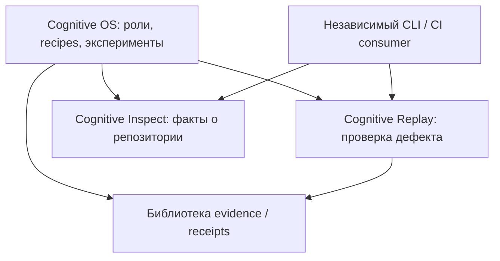

> Датированный отчёт. Текущий статус: [DEVELOPMENT_STATUS.md](DEVELOPMENT_STATUS.md); карта исходников: [PROJECT_MAP.md](PROJECT_MAP.md).

# Cognitive OS: зрелость компонентов и границы подпроектов

Срез: 10 сентября 2026. Это архитектурная оценка по исходникам и проверкам;
баллы ролевого evaluator здесь не используются как оценка зрелости библиотек.

## Решение

Cognitive OS в целом — работающая исследовательская платформа для управляемых
экспериментов. Оснований объявлять её готовым универсальным инженерным продуктом
пока нет: перенос на новые дефекты и преимущество полной цепочки над прямым
исполнителем ещё требуют доказательств.

При этом внутри уже есть самостоятельно полезные компоненты с существенно
более узкими обязательствами. Рекомендация — выделить **два подпроекта внутри
текущего monorepo**: воспроизведение/проверку дефектов и инспектор репозиториев.
Первыми целями должны стать независимые установка, API и тесты. Отдельные Git-
репозитории понадобятся при появлении собственных потребителей и циклов выпуска.

Не следует переносить весь `runtime/` в общий пакет или создавать отдельный
репозиторий для каждой роли. Полезная граница проходит по самостоятельной задаче
пользователя и проверяемому результату.

## Как оценивалась зрелость

Использованы четыре независимые оси:

1. Поведение: определён ли узкий контракт, есть ли успешные и отрицательные проверки.
2. Самостоятельность: может ли код работать без остальных частей Cognitive OS.
3. Поставка: есть ли устанавливаемый пакет, публичный API, поддерживаемые версии и CI.
4. Эксплуатация: подтверждены ли использование внешними потребителями, восстановление
   после отказов, ограничения ресурсов и пригодность в заявленной среде.

Число тестов характеризует объём проведённой проверки, но не является процентом
покрытия или автоматической оценкой production readiness. Здесь используются
статусы «исследование», «проверенный внутренний компонент» и «кандидат на отдельную
alpha», без новой произвольной шкалы 9,7/10.

## Оценка частей

| Часть | Что уже доказано | Что ограничивает зрелость | Решение |
| --- | --- | --- | --- |
| Defect qualification / replay | Изолированные зависимости, повтор baseline, точные pytest outcomes, проверка fixed suite и сохранности source; Granny и Rosbags qualified | Два реальных случая текущей кампании; отсутствие отдельной поставки; связь с mining/certification; worktree/venv не является границей безопасности ОС | Первый кандидат на отдельную CLI alpha |
| Repository facts | Чтение дерева, определение стека, Python AST и команды запуска; 27 тестов в отдельной копии | Неполное понимание динамического кода; нужен явный контракт полноты и ограничений сканирования; отдельной поставки нет | Второй кандидат на отдельную CLI/API alpha |
| Evidence ledger, schema validation, process helpers | Компактные детерминированные функции, проверки целостности и ошибок; легко отделимы | Хеши подтверждают целостность; разные строки producer/evaluator сами по себе не удостоверяют личности и независимость; нет обещаний долговременного хранения | Выделять как небольшие внутренние библиотеки по мере повторного использования |
| Durable queue / execution runtime | Lease tokens, защита от старого worker, повтор задач и recovery; очередь работает в изолированной копии | Очередь хранит Pipeline-модель; worker связан с recovery; не предъявлены нагрузочные и crash-consistency доказательства для самостоятельного сервиса | Сохранить внутри платформы, стабилизировать интерфейс |
| Каталог точных repair recipes | Успешны известные Click, Autoflake, isort, Platformdirs, Marshmallow и Invoke cases | Узкие формы, большая связь intake с development; свежий перенос ещё не подтверждён | Сохранить как ограниченные adapters/recipes исследовательской платформы |
| Project Analyzer с интерпретацией, Architect, SpecWriter и остальная цепочка | Артефакты, handoff и управляемые остановки исполняются | Семантическая оценка новых дефектов ниже цели, внешняя продуктовая польза ещё не измерена | Продолжать R&D в Cognitive OS |
| Evaluation / mining / certification | Воспроизводимые протоколы, manifests, отчёты и проверки границ evidence | Классификатор библиотек даёт ложные категории; independent blind scorecards для product comparison отсутствуют | Внутренняя лаборатория; позднее возможен самостоятельный набор инструментов |

У зрелого внутреннего компонента может ещё не быть зрелой поставки. Для первых
двух кандидатов доказательств уже достаточно, чтобы начать подготовку alpha;
production-статус потребует отдельной проверки в использовании.

## Проверка самостоятельности

Статический AST-анализ охватил **1026 production Python modules** из runtime,
tools и plugins; синтаксических ошибок не найдено. В `runtime/` имеется 608
Python-файлов непосредственно верхнего уровня. Ограничение 400 строк помогает
размеру файлов, но само по себе не создаёт границ пакетов.

| Вход в компонент | Модулей в статическом замыкании импортов | Строк исходников в нём |
| --- | ---: | ---: |
| Evidence ledger | 1 | 165 |
| Schema validation | 1 | 132 |
| Process helpers + Windows job runner | 2 | 322 |
| Durable queue | 4 | 555 |
| Registry | 8 | 809 |
| Repository facts: четыре операции | 10 | 1366 |
| Historical defect qualification | 13 | 2080 |
| Project map report | 18 | 3109 |
| Pipeline executor | 22 | 2244 |
| Worker pool с recovery | 31 | 3834 |
| Project Analyzer с интерпретацией | 69 | 10430 |
| Project-native failure intake | 270 | 39837 |

Это **возможные статические импорты**, включая lazy imports; таблица не утверждает,
что все они исполняются при старте. Динамические загрузки и JSON/data dependencies
не раскрываются этим подсчётом полностью. Qualification дополнительно читает файл
pytest plugin как ресурс. Project map ищет knowledge-файлы через родительские
каталоги, поэтому его нельзя оценивать только по импортам.

Выявлен цикл между `project_development`, `project_development_core`,
`project_development_experiment`, `project_native_failure_intake` и
`project_native_failure_intake_core`. Поэтому полный native intake — плохая первая
граница для извлечения. Число 270 указывает на связанность; оно не означает,
что будущему подпроекту обязательно потребуются все эти модули.

Источники: [инвентаризация](artifacts/architecture/component_inventory_20260910.json),
[скрипт анализа](artifacts/architecture/inspect_components_20260910.py).

Затем созданы три отдельные копии только нужных исходников и существующих тестов.
Использован новый venv CPython 3.10.11, зависимости pytest/packaging установлены
из локального wheelhouse. Исходный checkout не добавлялся в import path;
проверены фактические расположения загруженных runtime/plugin modules.

| Изолированный набор | Результат | Время pytest | Импортов из исходного checkout |
| --- | --- | ---: | ---: |
| Evidence ledger + schema fallback + durable queue/lock | 15 passed | 0,23 с | 0 |
| Repository facts | 27 passed | 0,41 с | 0 |
| Defect qualification | 44 passed | 94,87 с | 0 |

Всего **86 passed**, failures/errors/skips — 0. Хеши исходников после проверки
совпадают с исходными. Это проверка отделимости копии исходников; сборка wheel
и тестирование установленного distribution ещё не выполнены. Четыре проверки
schema в этом изолированном наборе относятся к fallback validator.

Источники: [отчёт проверки](artifacts/architecture/component_export_probe_20260910.json),
[скрипт](artifacts/architecture/probe_component_exports_20260910.py).
Артефакты экспорта лежат под `artifacts/architecture/component_exports_4cb505e8/`.
Рабочие модули приложения при этой оценке не переносились и не изменялись.

## Подпроект 1: Cognitive Replay — рабочее название

**Пользовательская задача:** проверить, что конкретный дефект воспроизводится,
а предложенное исправление закрывает исходные упавшие тесты и сохраняет
проверяемые свойства проекта. Пользователь может принести patch любого происхождения.

Предлагаемый контракт:

```text
repository + baseline revision + regression tests + patch + frozen environment
    -> repeated baseline results
    -> fixed test results
    -> preserved source/worktree checks
    -> machine-readable replay receipt
```

В пакет входят runner одного case, подготовка окружения, pytest report plugin,
контроль процессов, временный Git worktree и проверка результата. Mining,
оценки ролей и требование двух cases каждого stratum остаются в адаптере Cognitive OS.
Первый CLI должен решать один законченный сценарий без запуска ролевой цепочки.

Основные разрезы:

- Убрать зависимость replay от `TARGET_TYPES` в mining: исследовательская
  классификация и пороги кампании не являются частью проверки одного дефекта.
- Извлечь читающую project metadata функцию из большого native environment helper
  в узкий публичный adapter. Сохранить проверку `requires-python`.
- Поставлять pytest plugin и schemas как ресурсы пакета; оставить versioned readers
  уже сохранённых receipts и согласованные правила digest.
- Описать ошибки: environment blocked, not reproduced, unstable baseline,
  fixed suite failed, source invariant failed и qualified.

Граница обещания: инструмент проверяет результаты заданного replay. Его отчёт
не присваивает интеллектуальную зрелость модели и не заменяет изоляцию ОС.
Текущие [Granny/Rosbags receipts](artifacts/self_development/historical_defect_mining/public_manifest_20260910T055018172748Z.json)
дают два реальных примера, помимо fixture-based тестов.

## Подпроект 2: Cognitive Inspect — рабочее название

**Пользовательская задача:** получить проверяемую структурную сводку репозитория
для CI, редактора, человека или другого агента без исполнения кода проекта.

Первая версия включает четыре операции: scan tree, detect stack, extract Python
structure и extract runtime commands. Выход — JSON с путями и доказательствами,
ограничениями чтения, skipped files и причинами неполного анализа.

В первую границу не включаются архитектурные рекомендации, выбор first slice,
доменные knowledge rules, inferred repair и ролевые scorecards. Эти функции
продолжают потреблять факты в Cognitive OS. Именно такой узкий набор прошёл
изолированную проверку на 27 тестах.

Перед alpha нужны явные root/path/size limits, поведение на неподдерживаемом
Python-синтаксисе, политика symlinks и единый стабильный формат отчёта.
Удобный внешний сценарий — одна команда, возвращающая JSON без конфигурации
LLM, knowledge corpus и локальных исторических artifacts.

## Почему пока monorepo

Отдельный пакет даст проверяемую независимость и собственные зависимости.
Отдельный репозиторий дополнительно потребует выпусков, версионирования совместных
контрактов и синхронизации исправлений. В текущем состоянии важнее доказать первую
границу на двух потребителях: Cognitive OS и независимом примере/CI integration.

Предлагаемое направление зависимостей:



Это целевая схема. Библиотеку evidence стоит выделить в общий пакет, когда оба
потребителя используют согласованный контракт; заранее объединять все helpers
в универсальный `core` не требуется. Queue, worker pool и role orchestration
остаются внутри платформы. Извлечение не должно создавать обратный импорт из
Replay/Inspect в исследовательский runtime.

## Что мешает назвать подпроекты готовыми к поставке

- В корне нет `pyproject.toml`/`setup.py` для установки самого Cognitive OS;
  многие CLI добавляют checkout в `sys.path`. У отдельных кандидатов нет
  самостоятельного distribution и опубликованного API compatibility contract.
- Текущий [CI workflow](.github/workflows/ci.yml) запускает Python 3.10 на Ubuntu,
  обычный pytest и MVP acceptance. Plugin tests выполняются через вложенный вызов
  `tools/check_plugins.py` из MVP acceptance, хотя обычный [pytest.ini](pytest.ini)
  их исключает. Установленные distributions будущих подпроектов, Windows и матрица
  поддерживаемых версий Python отдельными jobs пока не проверяются.
- Наличие version tags в JSON не доказывает совместимость будущих readers,
  packaged data и старых receipts. Нужны явные compatibility tests.
- В просмотренных evidence нет доказательств независимого использования
  выделенных пакетов, эксплуатационных SLO или долгих нагрузочных испытаний.

Первый release gate: собрать wheel, установить в чистый venv, запустить consumer
и тесты из каталога вне checkout. Для этого подходит `src` layout, который
помогает обнаруживать случайный импорт рабочей копии; это соответствует
[PyPA guidance](https://packaging.python.org/en/latest/discussions/src-layout-vs-flat-layout/)
и [рекомендациям pytest](https://docs.pytest.org/en/stable/explanation/goodpractices.html).
После этого — CI на явно поддерживаемых Windows/Linux и версиях Python,
контрактные проверки, отрицательные случаи, packaged resources и примеры.

## Очерёдность

1. Зафиксировать публичный контракт одного replay case и сделать устанавливаемый
   пакет Cognitive Replay в monorepo, сохранив адаптеры старого API для Cognitive OS.
2. Проверить установленный пакет на fixture-контрастах и реальных Granny/Rosbags
   cases; добавить внешний CLI example и независимый CI job.
3. Тем же способом выделить минимальный Cognitive Inspect и проверить установку
   без knowledge/artifacts каталогов исходного проекта.
4. После появления реального независимого потребителя решить вопрос отдельных
   Git-репозиториев. Ролевой holdout продолжать как отдельный исследовательский
   план; его результаты не должны блокировать выпуск корректного read-only
   инспектора или узкого replay-инструмента.

Предыдущий полный canonical прогон: 2961 core + 183 plugin tests. После последнего
изменения mining выполнены 72 focused tests и structural preflight 4/4. В этой
архитектурной оценке выполнены только описанные отдельные probes; новый полный
canonical прогон и миграция приложения не проводились.
