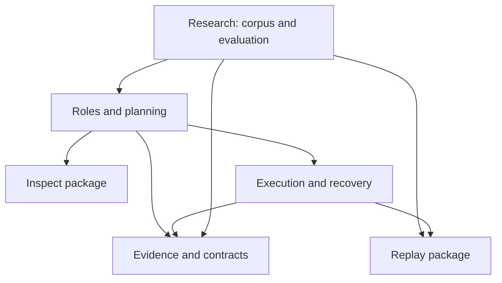

# Cognitive OS: карта проекта

Проект связывает цель, ролевые артефакты, контролируемое исполнение и проверяемые
результаты. В целом это исследовательская платформа. Текущее состояние и
доказательства собраны в [DEVELOPMENT_STATUS.md](DEVELOPMENT_STATUS.md).

| Подсистема | Где начинать | Ответственность |
|---|---|---|
| [Inspect](docs/architecture/inspect.md) | `packages/cognitive-inspect/src/cognitive_inspect/` | Факты о дереве, стеке, Python и командах |
| [Replay](docs/architecture/replay.md) | `packages/cognitive-replay/src/cognitive_replay/` | Повтор дефекта, проверка upstream fix и окружения |
| [Execution](docs/architecture/execution.md) | `runtime/executor.py`, `runtime/durable_queue.py` | Исполнение pipeline, очередь, leases, восстановление |
| [Evidence](docs/architecture/evidence.md) | `runtime/evidence_ledger.py`, `runtime/schema.py` | Контракты, целостность доказательств, проверка схем |
| [Roles](docs/architecture/roles.md) | `runtime/configured_role_pipeline.py` | Анализ, планы, спецификации, роль исполнения и review |
| [Research](docs/architecture/research.md) | `runtime/local_historical_defect_mining.py`, `runtime/three_route_evaluation.py` | Корпус, обучение, независимая оценка и допуск |

Это смысловые области, а не шесть независимых продуктов. Inspect и Replay уже
имеют отдельные Python-пакеты; остальные области пока сохраняют существующие
пути. Список точек входа, контрактов, тестов и связей хранится в
[subsystems.json](docs/architecture/subsystems.json) и проверяется инструментом.



Стрелки показывают разрешённое использование на уровне областей; это не полный
граф всех импортов. Оба пакета независимы от runtime, ролей и друг от друга.
В существующем native-failure intake остаются циклы; его перенос целиком отложен.

Для конкретной задачи:

```bash
python tools/project_context.py --subsystem replay
python tools/project_context.py --path runtime/durable_queue.py --format json
python tools/project_context.py --subsystem roles --subsystem inspect --output artifacts/context/analysis.md
python tools/project_context.py --check
```

Контекст содержит краткое описание области и ссылки на исходники, а не весь
репозиторий. Политика документации и измерения эффекта:
[architecture/README](docs/architecture/README.md). История:
[history/README](docs/history/README.md).
