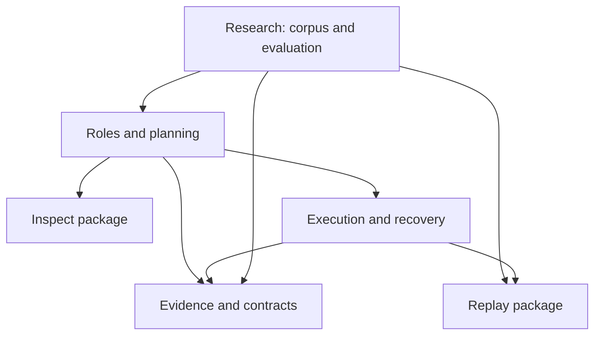

# Cognitive OS: карта проекта

Проект связывает цель, ролевые артефакты, контролируемое исполнение и проверяемые
результаты. В целом это исследовательская платформа. Текущее состояние и
доказательства собраны в [DEVELOPMENT_STATUS.md](DEVELOPMENT_STATUS.md).
Незавершённые структурные задачи для ассистента автоматически сохраняются в
[очереди](DEVELOPMENT_TASKS.json); [порядок продолжения](DEVELOPMENT_TASKS.md)
помогает подхватить их при следующем этапе без напоминания пользователя.

Приоритеты дальнейшей работы: [проверенный результат и достаточный локальный
контекст](docs/architecture/development_workflow.md). Общий размер архитектуры
вторичен; границы компонентов и проверка последствий изменений обязательны.

Целевая организация знаний: [плагины компетенций с собственной KB](docs/architecture/plugin_owned_knowledge.md).
Общий слой сохраняет каталог, протоколы, контекст задачи и журнал доказательств.
Первый [пилот pickle](docs/architecture/pickle_competency_20260915.md) выделяет
рабочий механизм и убирает его специальные ветки из общего интерпретатора;
миграция остальных знаний и исследовательских инструментов продолжается отдельно.

Второй владелец — [append mapping](docs/architecture/append_mapping_owner_20260915.md):
профиль границы и контраст в локальной KB;
[извлекатель](docs/architecture/append_mapping_extractor_20260915.md) использует
общие AST-функции Inspect. [Рецепт](docs/architecture/append_mapping_recipe_20260915.md)
также принадлежит плагину. [Общий контракт результата](docs/architecture/helper_recovery_contract_20260915.md)
отделяет его метаданные от координации кандидатов и применения в runtime.

Третий владелец — [JSON serialization](docs/architecture/json_serialization_20260916.md):
рецепт, алгоритм и результат извлечения helper в отдельном плагине;
общая координация и исследовательское распознавание сохраняют прежние границы.

Четвёртый владелец — [JSON parsing](docs/architecture/json_parsing_20260916.md):
извлечение helper из inline json.loads/read_text, с прежними контрактами
и отдельной от сетевого parsing областью.

Пятый владелец — [text splitting](docs/architecture/text_splitting_20260916.md):
последний из четырёх текущих helper extractors. Их runtime-модуль содержит
совместимые импорты; алгоритмы, recipe и metadata принадлежат плагинам.

[Выбор helper recipe](docs/architecture/helper_recipe_reads_20260916.md) читает
каталог один раз; следующий кандидат и verifier повторяют свежий допуск.

Для описания назначения и пользовательских сценариев проекта используйте
`tools/describe_project.py`: [компетенция описания](plugins/project_description/README.md)
владеет отбором свидетельств и правилами объяснения; runtime организует модельные
черновик/review и проверяет ссылки на источники.

Цели и критерии ролевой зрелости: [DEVELOPMENT_PLAN_97.md](DEVELOPMENT_PLAN_97.md).
Текущий фокус — [Analyzer → Architect → SpecWriter](docs/architecture/upstream_roles_20260913.md):
контракт задачи, происхождение выводов, конкретный причинный дизайн.

| Подсистема | Где начинать | Ответственность |
|---|---|---|
| [Inspect](docs/architecture/inspect.md) | `packages/cognitive-inspect/src/cognitive_inspect/` | Факты о дереве, стеке, Python и командах |
| [Replay](docs/architecture/replay.md) | `packages/cognitive-replay/src/cognitive_replay/` | Повтор дефекта, проверка upstream fix и окружения |
| [Execution](docs/architecture/execution.md) | `runtime/executor.py`, `runtime/durable_queue.py` | Исполнение pipeline, очередь, leases, восстановление |
| [Evidence](docs/architecture/evidence.md) | `runtime/evidence_ledger.py`, `runtime/schema.py` | Контракты, целостность доказательств, проверка схем |
| [Roles](docs/architecture/roles.md) | `runtime/configured_role_pipeline.py` | Анализ, планы, спецификации, роль исполнения и review |
| [Research](docs/architecture/research.md) | `runtime/local_historical_defect_mining.py`, `runtime/three_route_evaluation.py` | Корпус, обучение, независимая оценка и допуск |

Это смысловые области, а не шесть независимых продуктов. Inspect и Replay уже
имеют отдельные Python-пакеты; остальные области пока сохраняют существующие
пути. Список точек входа, контрактов, тестов и связей хранится в
[subsystems.json](docs/architecture/subsystems.json) и проверяется инструментом.


```mermaid
flowchart TD
    Research[Research: corpus and evaluation] --> Roles[Roles and planning]
    Research --> Replay[Replay package]
    Roles --> Inspect[Inspect package]
    Roles --> Execution[Execution and recovery]
    Roles --> Evidence[Evidence and contracts]
    Execution --> Evidence
    Execution --> Replay
    Research --> Evidence
```

Стрелки показывают разрешённое использование на уровне областей; это не полный
граф всех импортов. Оба пакета независимы от runtime, ролей и друг от друга.
В существующем native-failure intake остаются циклы; его перенос целиком отложен.

Для конкретной задачи:

```bash
python tools/project_context.py --subsystem replay
python tools/project_context.py --path runtime/durable_queue.py --format json
python tools/project_context.py --subsystem roles --subsystem inspect --output artifacts/context/analysis.md
python tools/project_context.py --check
```

Контекст содержит краткое описание области и ссылки на исходники, а не весь
репозиторий. Политика документации и измерения эффекта:
[architecture/README](docs/architecture/README.md). История:
[history/README](docs/history/README.md).
